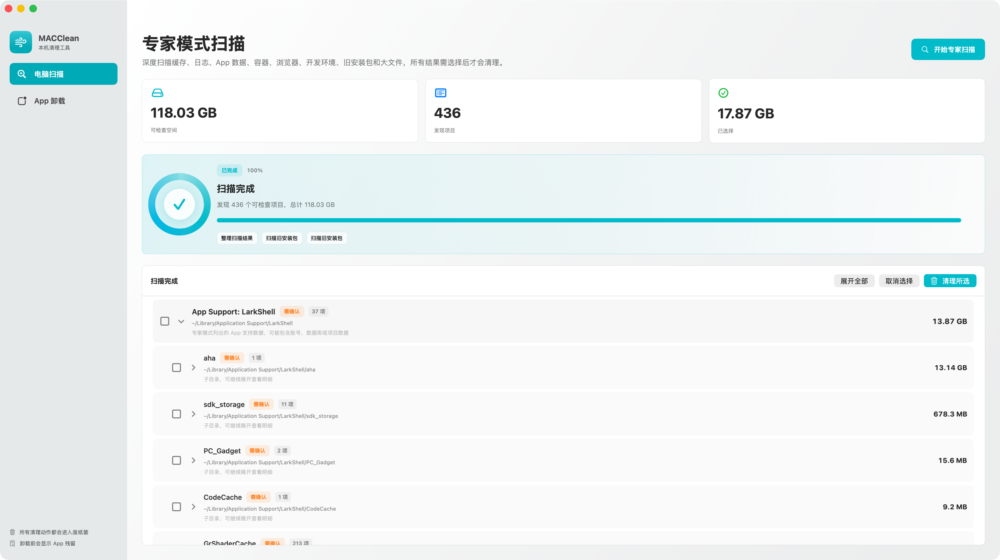
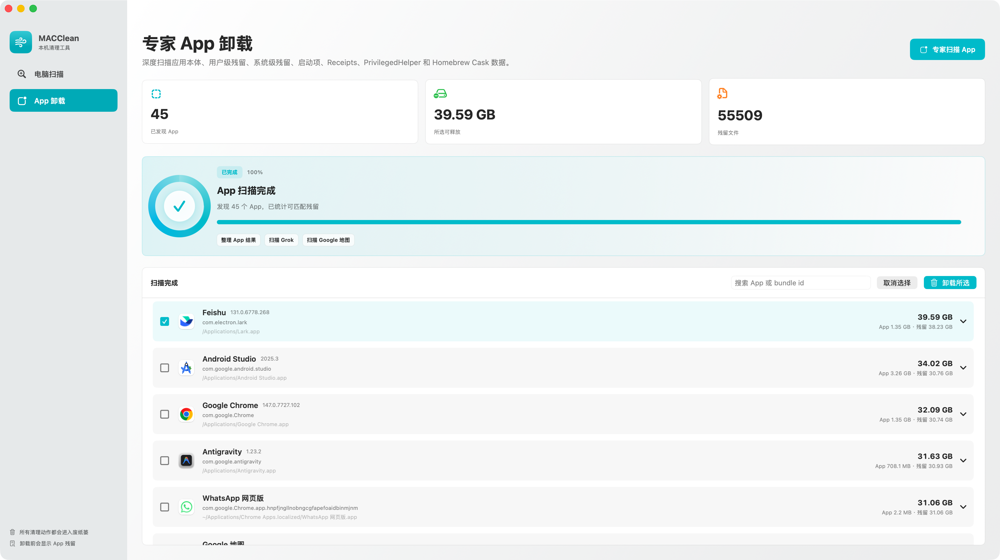

# MACClean

MACClean is an open-source macOS cleanup utility built with SwiftUI. It focuses on expert-level visibility: it scans local cleanup candidates, lets users inspect directory trees, and moves selected items to the macOS Trash only after confirmation.





## Features

- Expert cleanup scan for caches, logs, app support data, containers, browser data, developer caches, backups, old installers, and large files.
- Lazy expandable directory tree so large folders can be inspected without blocking the UI.
- App uninstall scanner for `/Applications` and `~/Applications`.
- Residue detection by bundle id and app name across user and system locations.
- Detection for LaunchAgents, LaunchDaemons, PrivilegedHelperTools, Receipts, and Homebrew Cask data.
- Animated scan, cleanup, uninstall, and search states.
- Risk labels: `可清理`, `需确认`, and `需管理员`.
- Safety-first deletion: selected files are moved to Trash, not permanently deleted.

## Safety Model

MACClean does not clean anything automatically.

- Users must select rows manually.
- Cleanup and uninstall actions require confirmation.
- Items are moved to the macOS Trash.
- Items marked `需确认` may contain user data and should be reviewed.
- Items marked `需管理员` are shown for expert visibility and may fail without elevated permissions.

## Requirements

- macOS 14 or later
- Xcode command line tools
- Swift 6 compatible toolchain

## Run

```sh
git clone https://github.com/wujian1992/MACClean.git
cd MACClean
swift run MACClean
```

For the local checkout:

```sh
cd /Users/reyeah/Documents/MACClean
swift run MACClean
```

## Build

```sh
swift build
```

## Project Structure

```text
Package.swift
Sources/MACClean/
  MACCleanApp.swift
  ContentView.swift
  CleanupView.swift
  AppsView.swift
  CleanupStore.swift
  AppsStore.swift
  FileSizeScanner.swift
  Models.swift
  SharedViews.swift
docs/images/
scan_mac_junk.zsh
```

## Notes

The app is intentionally conservative. It currently uses normal user permissions and does not include a privileged helper. System-level paths are visible in expert mode, but moving them to Trash may fail if macOS denies access.

## License

MIT
